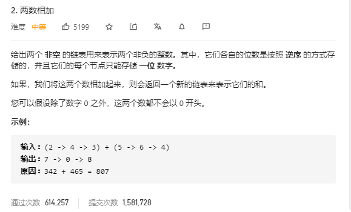

# 题目：两数相加


```javascript
/**
 * Definition for singly-linked list.
 * function ListNode(val, next) {
 *     this.val = (val===undefined ? 0 : val)
 *     this.next = (next===undefined ? null : next)
 * }
 */
/**
 * @param {ListNode} l1
 * @param {ListNode} l2
 * @return {ListNode}
 */
 ```

## 结果
```javascript
var addTwoNumbers = function(l1, l2) {
    let result = new ListNode('xxx')
    let add = 0
    let val = 0
    let pre = result
    do {
        let num1 = l1 ? l1.val : 0
        let num2 = l2 ? l2.val : 0
        sum = num1 + num2
        if (add) {
            sum++
            add = 0
        }
        val = sum >= 10 ? sum % 10 : sum
        pre.next = new ListNode(val)
        pre = pre.next
        if (sum >= 10) {
            add = 1
        }
        l1 && (l1 = l1.next)
        l2 && (l2 = l2.next)
     } while( l1 || l2)
     if (add) {
         pre.next = new ListNode(1)
     }
     return result.next
};
```

## 总结
关于列表的定义一头雾水，这个答案也是看了别人的解答，依然很困难，有待继续思考，而且很多边界情况都是一遍一遍试错试出来的